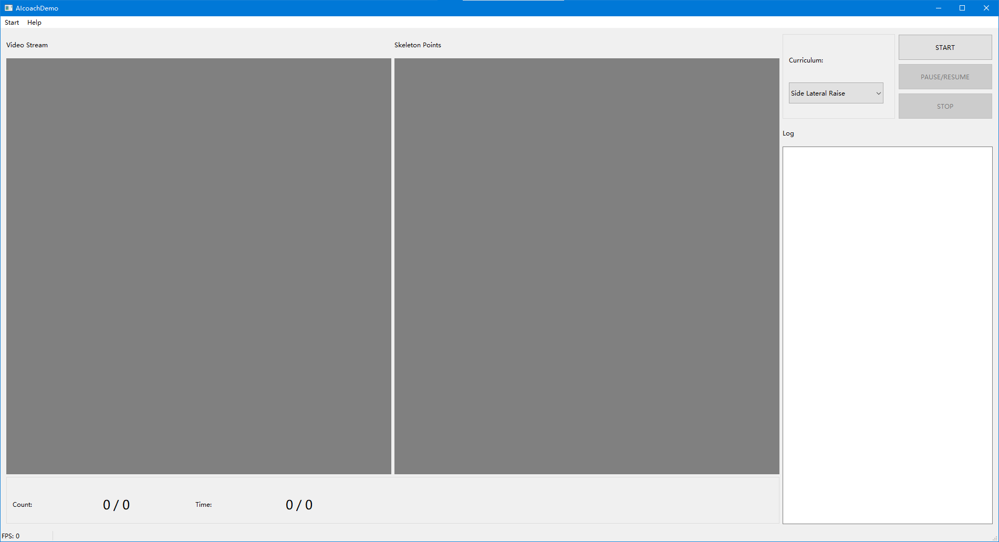
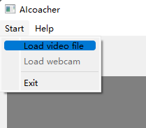
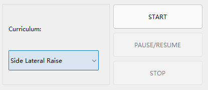

# AICoacher

[**AICoacher**](https://github.com/liutiel/AICoacher) has represented **an online real-time workout coach system framework which builds up an extensible AI based architecture supporting multiple categories of workout**.

## Contents
1. [Features](#features)
2. [Installation](#installation)
3. [Quick Start Overview](#quick-start-overview)
4. [Send Us Feedback!](#send-us-feedback)
5. [Citation](#citation)
6. [License](#license)
7. [Related Work](#related-work)

## Features
- **Main Functionality**:  
    - **Workout Counting**:  
        Three categories of workout actions are supported:  
        - Side Lateral Raise  
        

            
        

        - Y-Stretch  
        

            
        

        - Squat  
        

            
        

    - **Workout Scheduling**  
    - **Workout Tips**  
- **System Highlight**:  
    - The key frames of one workout action are extracted automatically and the feature vectors are calculated with the body pose points.  
    - The workout actions are efficiently recognized with a state transfer matrix while the temporal continuous characteristics of one workout action can be well captured.  
    - The workout repetition counts and correction tips can be well output by AICoacher while the user can be instructed for better workout experience.  

## Installation
If you want to use AICoacher without installing or writing any code, simply download the latest release of AICoacher to your Windows x64 computer!  

Otherwise, you could build AICoacher from source.  

### Requirements: 
Microsoft Windows x64  
Visual Studio 2019 with Visual C++ 2019  
Qt 5.15.2 and Qt integration for Visual Studio
OpenCV 4.5.1  
tflist-dist(A third-party tensorflow C++ interface)  

### Compiling Steps: 
1. Install all the requirements above.  
2. Double-click the **AIcoachToolbox.sln** solution file.  
3. Right-click the **AIcoachDemo** module and click **Generate**.  
4. Enjoy using AICoacher! 

## Quick Start Overview
1. Simply start the AICoacher by double-clicking the **RunAICoacher.bat**, and you'll see the GUI of AICoacher:  

    

2. To load a video stream, click **Start -> Load video file / Load webcam**, and select a video file or input a webcam index. 

    

3. To select the curriculum, click the combobox here; To start / pause / resume / stop traning, press the buttons at right. 

    

## Send Us Feedback!
Our library is open source for research purposes, and we want to improve it! So let us know (create a new GitHub issue or pull request, email us, etc.) if you...  
1. Find/fix any bug (in functionality or speed) or know how to speed up or improve any part of AICoacher.  
2. Want to add/show some cool functionality/demo/project made on top of AICoacher. 

## License
AICoacher is licensed under Licensed under Apache v2 license. Please, see the [license](./LICENSE) for further details.  

## Citation
  
## Related Work
