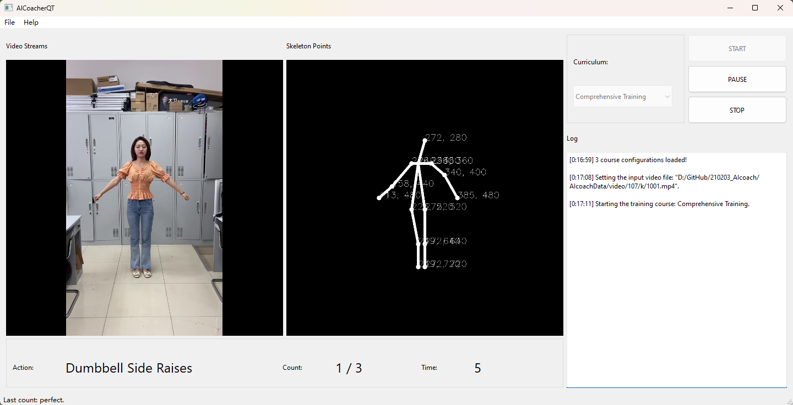
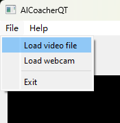
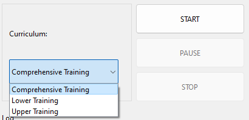

# AICoacher

[**AICoacher**](https://github.com/liutiel/AICoacher) has represented **an online real-time workout coach system framework which builds up an extensible AI based architecture supporting multiple categories of workout**.

## Contents
1. [Features](#features)
2. [Installation](#installation)
3. [Quick Start Overview](#quick-start-overview)
4. [Send Us Feedback!](#send-us-feedback)
5. [License](#license)
6. [Related Work](#related-work)


## Features
- **Main Functionality**:  
    - **Workout Counting**:  
        12 categories of workout actions are supported by default, and you can create your custom workout actions easily.  
        - Alternating Side Leg Raises
        - Y-Stretch  
        - Squat  
        - Alternating Knee Patting
        - Dumbbell Side Raises
        - Head and Knee Twist
        - Jumping Jacks
        - Lunge Squat (L/R)
        - Standing Wood Chops (L/R)
        - Swing Arms Squat

        <p align="left">
            
            
            
        </p>

    - **Workout Perfection Assessment**  
    Telling the user whether the last action was completed perfectly or not.  
        <p align="left">
            
        </p>

    - **Workout Scheduling**  
    Providing training courses with sorted training actions whose time limits and count limits are determined. AICoacher can shift automatically between training actions according to course configurations. You can also feel free to create your custom training course. 

- **System Highlight**  
    - The key frames of one workout action are extracted automatically and the feature vectors are calculated with the body pose points.  
    - The workout actions are efficiently recognized with a state transfer matrix while the temporal continuous characteristics of one workout action can be well captured.  
    - The workout repetition counts and correction tips can be well output by AICoacher while the user can be instructed for better workout experience.  

## Installation
### Running Binaries Directly
Simply [download the latest release of AICoacher](https://github.com/liutiel/AICoacher/releases) to your device, you can use AICoacher directly by clicking **"AICoacher.lnk"**, without any installing or compiling steps. 
- **Recommended Environment**  
    **OS:** Windows 10 (x64) or above / Windows Server 2016 or above  
- **Tip**  
    If AICoacher cannot start properly on your device, try running **"vc_redist.x64.exe"** first.  

### Build from Source
- **Requirements**  
    **OS:** Windows 10 (x64) or above / Windows Server 2016 or above  
    **IDE:** Visual Studio 2022 with "Desktop development with C++" workload installed  
    Qt 6.3.1 and Qt integration for Visual Studio 2022  
    OpenCV 4.5.1  
    [tflite-dist](https://github.com/ValYouW/tflite-dist) (A third-party tensorflow C++ interface)  

1. Install all the required software above, and add the below environment viariables to the operating system:   
```
    OpenCV_DIR:  .../OpenCV/  
    Qt_DIR:      .../Qt/6.3.1/msvc2019_64/  
    TFLite_DIR:  .../tflite-dist/   
```
2. Open the **AICoacher.sln** solution file in Visual Studio.  
3. Choosing compile mode. Select **"Debug - x64"** mode for debugging AICoacher within Visual Studio; select **"Release - x64"** mode for generating AICoacher binaries which can run outside of Visual Studio. 
4. Right-click the **PoseDetector**, **VideoIO**, **Coacher**, **AICoacherQT** module and click **Generate** to compile the project.  If you've chosen "debug mode" in step 3, you can now start AICocaher by clicking the **"Local Windows Compiler"** button.  

<p align="left">
    
</p>

5. If you've chosen "release mode" in step 3, create a new folder and copy the following folders from the project to the newly created folder:  

```  
    ./x64/Release
    ./configs
    ./models
```  

P.S. If you are trying to generate binaries running anywhere, please add **Qt**, **OpenCV** and **tflist-dist** libraries to the newly created folder. 

6. Enjoy using AICoacher! 

## Quick Start Overview
### User Interface  

<p align="left">
    
</p>

### Load A Video Stream
To load a video stream, click **Start -> Load video file / Load webcam**, and select a video file or input a webcam index. 
<p align="left">
    
</p>

### Selecting A Curriculum and Start Training
To select the curriculum, click the combobox shown below; To start / pause / resume / stop traning, press the buttons at right. 
<p align="left">
    
</p>

### Creating Your Custom Curriculum
The curriculum configuration files are located at **./configs/health_course/**. You can add your cumtom curriculum by adding .txt files to this folder.  
[Here](./configs/health_course/) are the examples of curriculum configuration files. You can learn how to create a curriculum configuration file by reading the examples.  
### Creating Your Custom Training Action
The training action configuration files are located at **./configs/health_action/**. You can add your cumtom training action by adding .txt files to this folder.  
[Here](./configs/health_action/) are the examples of training action configuration files. You can learn how to create a training action configuration file by reading the examples.  

## Send Us Feedback!
Our library is open source for research purposes, and we want to improve it! So let us know (create a new GitHub issue or pull request, email us, etc.) if you...  
1. Find/fix any bug (in functionality or speed) or know how to speed up or improve any part of AICoacher.  
2. Want to add/show some cool functionality/demo/project made on top of AICoacher. 

## License
AICoacher is licensed under Licensed under Apache v2 license. Please, see the [license](./LICENSE) for further details.  

## Related Work
This is the open source implementation of the ACM Multimedia '21 paper *"AICoacher: A System Framework for Online Realtime Workout Coach"* ([DOI: 10.1145/3474085.3478321](https://doi.org/10.1145/3474085.3478321))  
Please **cite** this paper if this project contributes to your work, thank you!  